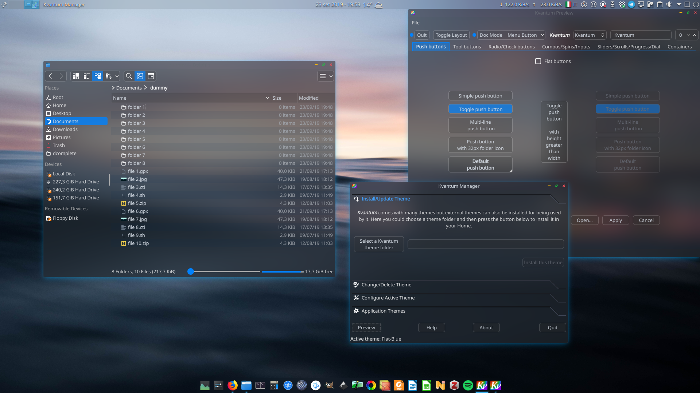

# FlatBlur

FlatBlur is a flat, minimal, blurried, mid-dark Kvantum theme, based on [Akava-Kv](https://github.com/Akava-Design/Akava-Kv), that try to use as much translucency as possible.

It comes in three different colors: blue, green, red.

# Requirements

Compile and install the latest [Kvantum theme manager](https://github.com/tsujan/Kvantum/tree/master/Kvantum). Latest version comes with the ability to use translucent colors on alternating row views (for instance, Dolphin in *Details View Mode*, see the above screenshot).

# Installation

1. Download the main branch and extract it to a folder.
2. Open Kvantum Manager -> *Install/Update Theme* -> Click on *Select Kvantum theme folder* -> Move to the extracted archive folder and select the theme folder you would like to use. -> Click *Install this theme*.
3. Click the section *Change/Delete Theme* and select the theme from the dropdown list. -> Click *Use this theme*.

# Recommendation

Use either [BreezeEnhanced](https://github.com/tsujan/BreezeEnhanced) or [SierraBreezeEnhanced](https://github.com/kupiqu/SierraBreezeEnhanced) window decorations.

# Issues

This theme is at an early development stage. Feel free to open an Issue to report any problem or to propose improvements.

Todo:

1. Rounded corners on Tabs.
2. Better color for inactive texts.